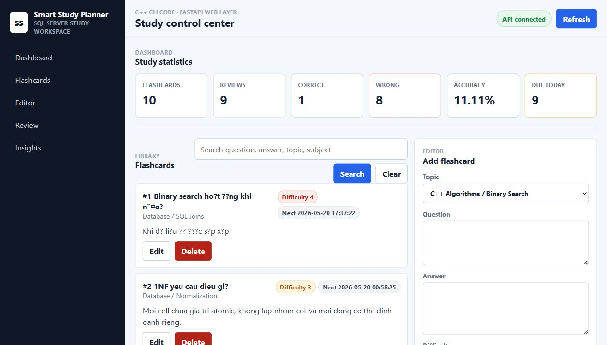

# Smart Study Planner

A C++20 and SQL Server flashcard planner that helps students organize topics, review flashcards, and track weak areas using a simple spaced-repetition workflow.



## Features

- Manage study flashcards from a C++ CLI.
- Store subjects, topics, flashcards, and review history in SQL Server.
- List all flashcards with subject, topic, difficulty, and next review time.
- Search flashcards by question, answer, topic, or subject.
- Add new flashcards from the terminal.
- Edit and delete existing flashcards.
- Review due flashcards and save correct/wrong results.
- Update the next review date based on review performance.
- Show weak topics based on wrong-answer rate.
- Show overall study statistics.
- Use the FastAPI web app dashboard for flashcards, reviews, weak topics, and statistics.

## Tech Stack

- C++20
- SQL Server Express
- ODBC Driver 18 for SQL Server
- CMake
- Visual Studio 2026 MSVC toolchain
- Git
- Python 3.12
- FastAPI
- HTML/CSS/JavaScript

## Database Schema

Main tables:

- `Subjects`
- `Topics`
- `Flashcards`
- `ReviewLogs`

Relationship overview:

```text
Subjects 1---N Topics 1---N Flashcards 1---N ReviewLogs
```

## CLI Menu

```text
Smart Study Planner
1. List flashcards
2. Search flashcards
3. Add flashcard
4. Edit flashcard
5. Delete flashcard
6. Review due flashcards
7. Show weak topics
8. Show study statistics
9. Exit
```

## Review Logic

When a flashcard is reviewed:

- Correct answer: review interval doubles, capped at 30 days.
- Wrong answer: review interval resets to 1 day.
- Every review is saved in `ReviewLogs`.

This keeps difficult cards appearing sooner while easier cards are gradually spaced out.

## Database Setup

Open SQL Server Management Studio and connect to:

```text
HOANE\SQLEXPRESS
```

Run these scripts in order:

```text
sql/schema.sql
sql/seed.sql
```

## Build

Open a Visual Studio Developer PowerShell or Developer Command Prompt, then run:

```powershell
cmake -S . -B build -G "NMake Makefiles"
cmake --build build
```

## Run

```powershell
.\build\smart_study_planner.exe
```

Optional:

```powershell
.\build\smart_study_planner.exe --server HOANE\SQLEXPRESS --database SmartStudyPlanner
```

## Run Web App

From the backend folder:

```powershell
cd C:\Users\Admin\Documents\project\web\backend
.\.venv\Scripts\activate
uvicorn app.main:app --reload
```

Open:

```text
http://127.0.0.1:8000
```

The web app connects to the same SQL Server database as the C++ CLI.

## Demo Checklist

1. Run the C++ CLI and choose `8` to show study statistics.
2. Start the FastAPI web app.
3. Open the dashboard at `http://127.0.0.1:8000`.
4. Search for a flashcard by question, answer, topic, or subject.
5. Add a new flashcard with a valid topic.
6. Edit the new flashcard from the web editor.
7. Review a due flashcard and mark it correct or wrong.
8. Check weak topics and updated study statistics.

## Project Structure

```text
smart-study-planner-cpp/
  include/
    DbConnection.h
    FlashcardRepository.h
    FlashcardService.h
    Menu.h
    ReviewRepository.h
    ReviewService.h
    StatisticsRepository.h
    StatisticsService.h
    TopicRepository.h
    TopicService.h
    Utils.h
    models/
      Flashcard.h
      Review.h
      StudyStatistics.h
      Topic.h
  src/
    DbConnection.cpp
    FlashcardRepository.cpp
    FlashcardService.cpp
    main.cpp
    Menu.cpp
    ReviewRepository.cpp
    ReviewService.cpp
    StatisticsRepository.cpp
    StatisticsService.cpp
    TopicRepository.cpp
    TopicService.cpp
    Utils.cpp
  sql/
    schema.sql
    seed.sql
  docs/
    API_CONTRACT.md
    WEB_MIGRATION_PLAN.md
    assets/
  CMakeLists.txt
  README.md
  web/
    backend/
    frontend/
```

## Web Migration

The CLI is structured so it can become a web app:

```text
main.cpp -> Menu -> Service -> Repository -> DbConnection -> SQL Server
```

See:

- `docs/API_CONTRACT.md`
- `docs/WEB_MIGRATION_PLAN.md`
- `web/README.md`

The FastAPI + plain HTML/CSS/JavaScript web app is available in `web/`.

## Learning Goals

This project demonstrates:

- SQL Server schema design
- C++ database connectivity with ODBC
- CLI application structure
- SQL joins and aggregate queries
- Basic spaced-repetition scheduling
- Git/GitHub project workflow
